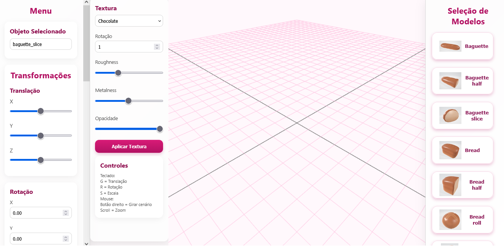

# Editor de Cena 3D

Editor de Cena 3D desenvolvido em **JavaScript** utilizando a biblioteca **Three.js**, como trabalho da disciplina de Computação Gráfica.

O projeto permite criar e editar cenas tridimensionais por meio de uma interface gráfica, possibilitando inserir modelos 3D, realizar transformações, modificar materiais, criar hierarquias entre objetos, aplicar animações simples e salvar/carregar cenas.

---

### Tela Principal

<p align="center">

</p>

# Tecnologias Utilizadas

- HTML5
- CSS3
- JavaScript ES6
- Three.js
- OBJLoader
- MTLLoader
- OrbitControls
- TransformControls
- WebGL

---

# Funcionalidades

O editor possui as seguintes funcionalidades:

- Inserção de modelos OBJ
- Carregamento automático dos materiais (.MTL)
- Seleção de objetos utilizando Raycaster
- Alteração da cor do objeto
- Translação
- Rotação
- Escala
- Manipulação pelo TransformControls
- Hierarquia Pai → Filho
- Remoção de hierarquia
- Animação simples através de velocidade
- Alteração de textura
- Controle de Roughness
- Controle de Metalness
- Controle de Opacidade
- Rotação da textura
- Exclusão de objetos
- Salvamento da cena em JSON
- Carregamento da cena salva

---

# Controles

## Mouse

| Ação | Função |
|-------|--------|
| Clique | Seleciona objeto |
| Botão direito | Rotaciona a câmera |
| Scroll | Zoom |

---

## Teclado

| Tecla | Função |
|--------|---------|
| G | Modo Translação |
| R | Modo Rotação |
| S | Modo Escala |

---

# Estrutura do Projeto

```
Projeto/

│
├── Assets/
│   ├── obj/
│   ├── previews/
│   
├── css/
│   └── style.css
│
├── html/
│   └── index.html
│
├── js/
│   ├── main.js
│   ├── sceneManager.js
│   ├── saveLoad.js
│   └── uiManager.js
│
└── README.md
```

---

# Organização do Código

O projeto foi dividido em módulos para facilitar manutenção e organização.

## main.js

Arquivo principal da aplicação.

Responsável por:

- criação da cena
- câmera
- renderer
- iluminação
- Grid
- carregamento dos modelos
- seleção
- animação
- texturas
- transformações
- hierarquia
- interação com o usuário

---

## sceneManager.js

Responsável pelo gerenciamento dos objetos presentes na cena.

Controla:

- lista de objetos
- objeto selecionado
- inserção
- seleção

---

## uiManager.js

Responsável pela comunicação entre a interface HTML e os objetos da cena.

Atualiza automaticamente:

- posição
- rotação
- escala
- nome do objeto

---

## saveLoad.js

Responsável por:

- salvar cena em JSON
- carregar cenas previamente salvas

---

# Como Funciona

## Criação da Cena

O programa cria inicialmente:

- Scene
- Camera
- Renderer
- Grid
- Luz Ambiente
- Luz Direcional

Todo objeto inserido posteriormente é adicionado à cena.

---

## Carregamento dos Modelos

Os modelos são carregados utilizando:

- OBJLoader
- MTLLoader

Sempre que um modelo é carregado:

- calcula Bounding Box
- calcula tamanho
- calcula escala
- posiciona corretamente sobre o Grid

Como cada modelo possui um arquivo `.mtl`, o Three.js aplica automaticamente seus materiais e texturas durante o carregamento.

---

## Seleção

A seleção dos objetos é realizada utilizando **Raycaster**.

O Raycaster lança um raio invisível da câmera até o ponto clicado pelo usuário.

Quando ocorre uma interseção:

- identifica o objeto clicado
- percorre sua hierarquia
- encontra o objeto selecionável
- cria um BoxHelper verde ao redor dele
- atualiza a interface

---

## Transformações

Cada objeto possui:

- posição
- rotação
- escala

Essas propriedades podem ser alteradas:

- pelos campos da interface
- pelos sliders
- pelo TransformControls

---

## Texturas

O usuário pode alterar:

- Cor
- Roughness
- Metalness
- Opacidade
- Rotação da textura

Também é possível restaurar os materiais originais carregados pelo arquivo MTL.

---

## Hierarquia

É possível criar relações entre objetos.

Exemplo:

```
Bolo

└── Vela
```

Quando o objeto pai é movimentado:

- o filho acompanha automaticamente.

A hierarquia também pode ser removida a qualquer momento.

---

## Animação

Cada objeto possui uma velocidade armazenada em:

```javascript
obj.userData.velocity
```

Durante o loop principal da aplicação:

```javascript
requestAnimationFrame()
```

essa velocidade é somada continuamente à posição do objeto, produzindo uma animação simples.

---

## Salvamento

A cena pode ser salva em um arquivo JSON contendo:

- posição
- rotação
- escala
- modelo utilizado
- propriedades dos objetos

Posteriormente, o arquivo pode ser carregado novamente.

---

# WebGL e Three.js

A aplicação utiliza **Three.js**, uma biblioteca que abstrai a complexidade da API WebGL.

Enquanto o WebGL exige programação de shaders, buffers e gerenciamento da GPU, o Three.js oferece classes de alto nível como:

- Scene
- Mesh
- Camera
- Geometry
- Material
- Renderer

permitindo desenvolver aplicações 3D de forma muito mais simples.

---

# Possíveis Melhorias Futuras

- Sistema de iluminação dinâmica
- Sombras em tempo real
- Importação de modelos GLTF
- Sistema de materiais PBR completo
- Editor de animações
- Duplicação de objetos
- Agrupamento de objetos
- melhores resultados em textura
- Sistema de camadas

## Para compilar

# - Usei VsCode : Live Server 
---

<h2>Demonstração</h2>

<video width="900" controls>
  <source src="videoSiteCG.mp4" type="video/mp4">
</video>

drive: https://drive.google.com/file/d/1EPM0EjKDf2kuSmp8Q0QpK7dctNICy9SU/view?usp=sharing
----
# Licença

Projeto desenvolvido exclusivamente para fins acadêmicos.

--- 
# links usados: 

- https://webgl2fundamentals.org/webgl/lessons
- https://threejs.org/
